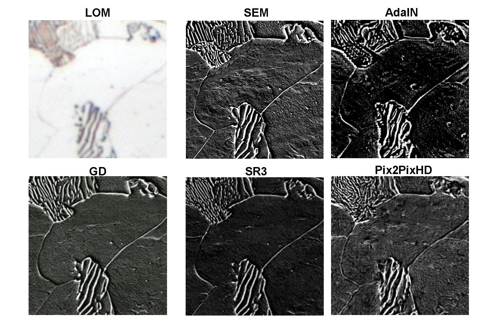

## LOM2SEM 



This repository is the Torch implementations of the four models described in [](). The paper implements these models to solve microscopy modality transfer between light optical images to scanning electron images. We found that the diffusion models far outperformed the AdaIN style mixing and Pix2PixHD GAN implementations.

## Requirements
For Pix2Pix and Palette models, at least 1 NVDIA GPUs with at least 12 GB of memory.
64-bit Python 3.12 and PyTorch 2.2. See [https://pytorch.org/](https://pytorch.org/) for PyTorch install instructions.
Python libraries can be downloaded via the requirements file `pip install -r requirements.txt`

## AdaIn
AdaIn is a style mixing generation model based on an Encoder-Decoder structure. [Paper](https://arxiv.org/pdf/1703.06868)| [Torch Implementation](https://github.com/xunhuang1995/AdaIN-style)

To train a Palette model, run the following command:
```bash
python -m Palette.run -p train -c ./Palette/config/lom2sem.json
```

## Pix2PixHD
Pix2PixHD is a conditional image generation model with a GAN architecture and standard MLP models. [Paper](https://arxiv.org/pdf/1711.11585.pdf) | [Official Implementation](https://github.com/NVIDIA/pix2pixHD) | [Project](https://tcwang0509.github.io/pix2pixHD/)
To train a Pix2PixGAN model, run the following command:
```bash
python -m Pix2Pix.train_p2phd --config Pix2Pix/configs/lom2sem.yaml
```

## Palette
Palette is a conditional image generation framework for diffusion models with a Unet architecture.  [Paper](https://arxiv.org/pdf/2111.05826.pdf) | [Official Implementation](https://iterative-refinement.github.io/palette/)
This implementation was built using this unofficial pytorch implementation: [Palette-Image-to-Image-Diffusion-Models](https://github.com/Janspiry/Palette-Image-to-Image-Diffusion-Models)
To train a Palette model, run the following command:
```bash
python -m Palette.run -p train -c ./Palette/config/lom2sem.json
```

## Eval Models
To evaluate the models use the `eval.py` file to extract the IOU, IS, FID.
```bash
python eval.py -t [ground image path] -g [generated image path]
```